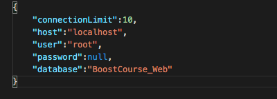

https://www.npmjs.com/package/mysqlasyncawaitwrapper

# MysqlAsyncWrapper

## npm i mysqlasyncawaitwrapper


the node js mysql module ( mysql.js https://www.npmjs.com/package/mysql ) is Only support Callbacks.

this wrapping package, wrap the mysql module and returning Promise.

so you can use async / await syntax with mysql js Package

### Usage

1. you need to make DB file , and put in Config.json file like this.


2. set Mysql connection Config like this.


;


(https://www.npmjs.com/package/mysql) 

it is completely same mysql module connection config.

3. get in library

```js
let mysqlAsync = require('mysqlasyncawaitwrapper');
```

4. 

```js
let {connected,release} = await mysqlAsync.connect();

const INSERT = 'INSERT INTO CATEGORY (NAME) VALUES("TEST")';
let result = await connected(INSERT);
...
release();
```


use it !

.connect method return connected,release method.

connected method is used sending query

release method is used returning connection to db pools

<hr/>

node js mysql 모듈은 콜백 기반이기 때문에 제가 너무 좋아하는 async/await 문법을 사용할 수 없어 만든 작은 라이브러리입니다. !

node js mysql 모듈을 감싸 Promise 기반의 모듈로 변형하는 역할을 수행합니다. !

### 필요한것

1. mysql모듈을 랩핑하기 때문에 , mysql 접속을 위한 config파일을 다음과 같이 db 파일을 넣어 Config.json 파일을 만들어주세요.


2. mysql connection 설정과 동일한 설정을 넣어주세요.

;

설정에 대한 자세한 옵션들은 mysql 홈페이지에서 확인해주세요 . (https://www.npmjs.com/package/mysql)

### Usage

1. require로 라이브러리를 가져옵니다.
```js
let mysqlAsync = require('mysqlasyncawaitwrapper');
```

2. db 폴더에 config.json 파일을 넣어 DB와 연동 가능하게 준비해줍시다.

```js
{
    "connectionLimit":10,
    "host":"localhost",
    "user":"root",
    "password":null,
    "database":"BoostCourse_Web"
}
```

3. .connect() 메소드로 DB와 연동을 시도합시다.

```js
let {connected,release} = await mysqlAsync.connect();

const INSERT = 'INSERT INTO CATEGORY (NAME) VALUES("TEST")';
let result = await connected(INSERT);
...
release();
```


connected 함수로 query를 날리는 것이 가능합니다.

release 함수는 연결된 커넥션을 커넥션풀로 돌려주는 함수입니다.
